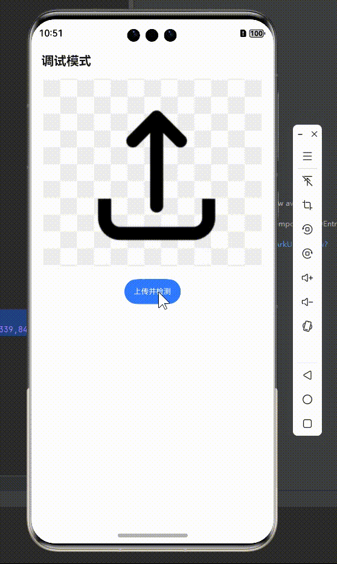

# PCB缺陷检测-鸿蒙APP

> PCB defect detector
>
> 第十九届“挑战杯”揭榜挂帅·华为赛道（高校赛道）- 面向新质生产力的AI质检助力制造业数智化创新
>
> powered by OpenHarmony

开发APP遇到了很多坑，决定公开一个仅可实现`图片选择`+`请求发送`的baseline。如果各位遇到困难且有缘看到这个项目，可以基于这个版本快速入门，进行后续的迭代。

## 开发环境

- Win11 x64
- DevEco Studio NEXT Developer Beta6
- 模拟器：HarmonyOS Next Developer Beta5

## 运行

> 注：为保证演示效果，录屏中并未真正将图片进行上传，预测结果是使用假数据的方式返回，因此预测速度以实际为准。

