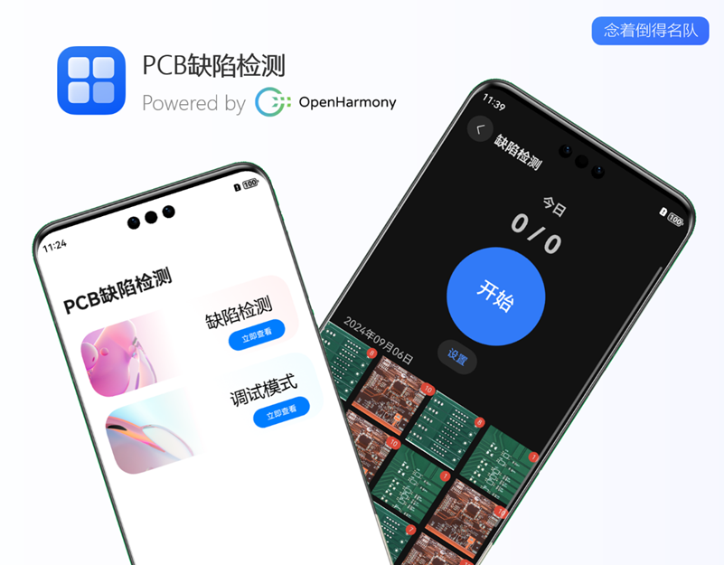
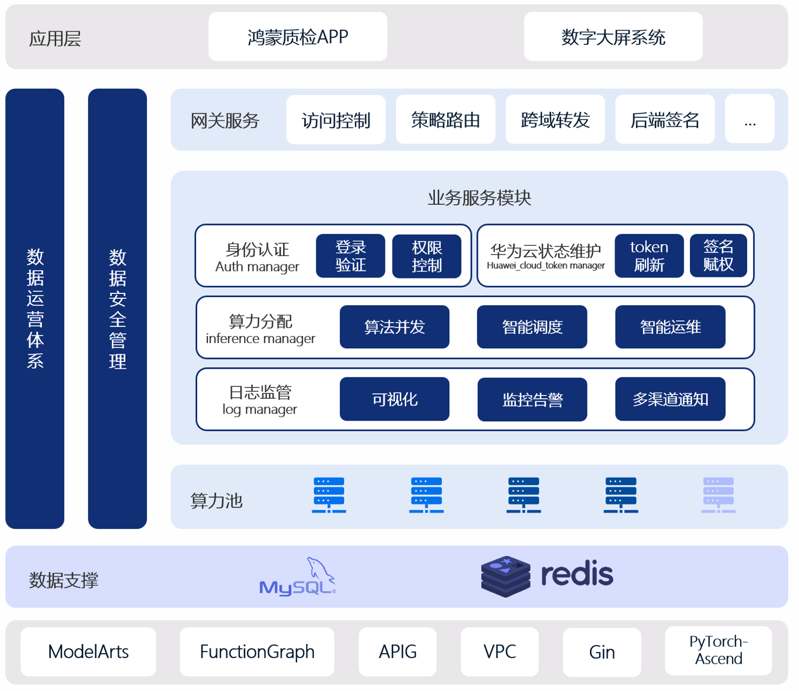
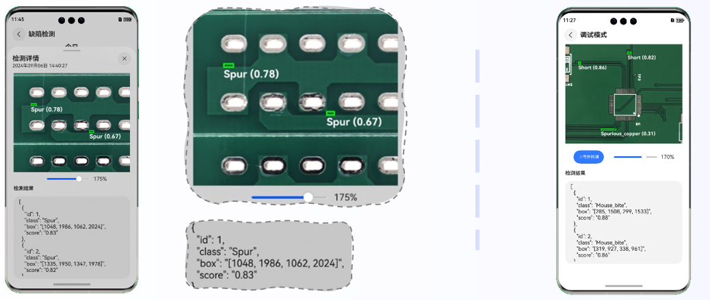

# PCB缺陷检测-鸿蒙APP

> PCB defect detector
>
> 第十九届“挑战杯”揭榜挂帅·华为赛道（高校赛道）- 面向新质生产力的AI质检助力制造业数智化创新
>
> powered by OpenHarmony

## Pre

没进决赛哈哈，但个人觉得这个APP开发得还算完整，开源完整版本，如果能帮助到他人就更好了。

完整项目使用华为云函数工作流`FunctionGraph`与API网关`APIG`封装后端，实现`华为云状态维护`与`算力分配`业务需求。若仅需要简单测试，可直接修改`detect.ets`中检测服务的`url`与`token`。答辩时画饼（核心功能已实现）的系统结构图如下：

## 开发环境

- Win11 x64
- DevEco Studio NEXT Developer Beta6
- 模拟器：HarmonyOS Next Developer Beta5

## 亮点

- 多线程检测能力：提升检测性能，使其更符合实际应用场景需求
- 交互逻辑完善：支持检测结果可视化、局部放大，优化检测结果文本展示逻辑，深色模式

## 相关项目

- [APP-PCB缺陷检测](https://github.com/LinJ0866/pcb-app-detector)
- [前端-数字大屏系统](https://github.com/LinJ0866/pcb-web-big_screen)
- [后端微服务-预测集群管理服务](https://github.com/LinJ0866/pcb-go-detect_service)
- [后端微服务-华为云token管理服务](https://github.com/LinJ0866/pcb-go-huawei_cloud_token_manager)
